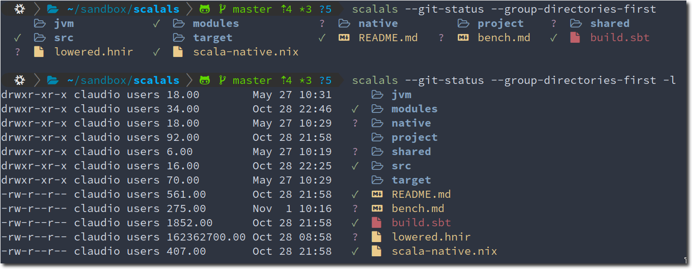

# About

This is yet another [colorls](https://github.com/athityakumar/colorls) clone.

# Features

1. fast (compiled to native code)
2. aims to be a drop-in replacement to GNU ls
3. supports `LS_COLORS`

# Install

1. download a pre-built [binary](https://github.com/avdv/scalals/releases/latest) for your platform (currently Linux amd64 / arm64 and macOS amd64 supported)
2. install a Nerd Font from [here](https://www.nerdfonts.com/font-downloads) and use it in your terminal emulator
3. set up your dircolors (see https://www.nordtheme.com/ports/dircolors for example)

## With nix flakes

Simply run `nix run github:avdv/scalals`. (_Hint_: `cachix use cbley` to avoid re-building)

# Building

## Using nix

1. run `cachix use cbley` (optional, but reduces build time significantly)
2. run `nix-shell --run sbt`

## Using nix flakes

1. run `cachix use cbley` (optional, but reduces build time significantly)
2. run `nix build`
